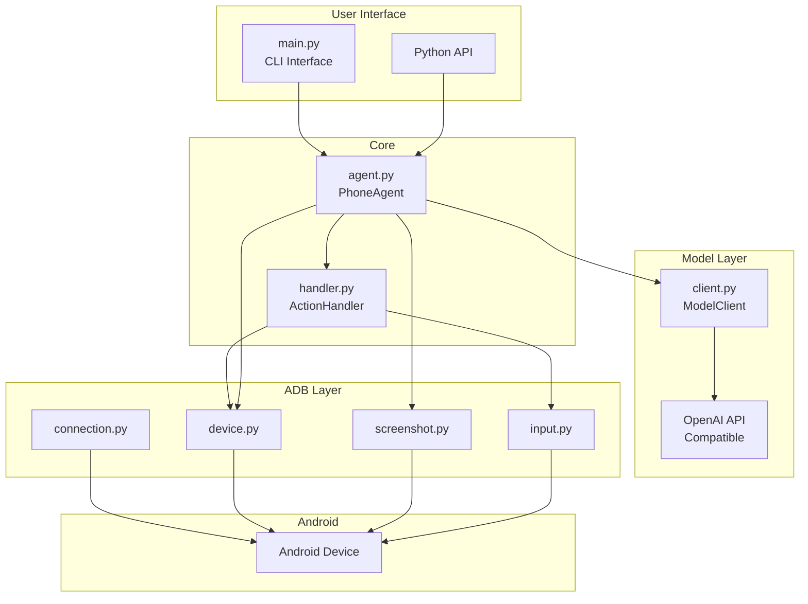

# Open-AutoGLM Repository Analysis Report

## Overview

**Repository**: [zai-org/Open-AutoGLM](https://github.com/zai-org/Open-AutoGLM)  
**Author**: Zhipu AI  
**License**: Apache 2.0  
**Purpose**: AI-powered phone automation framework using Vision-Language Models

**Open-AutoGLM** — это Phone Agent framework, который использует VLM (Vision-Language Model) для понимания экрана Android устройства и автоматического выполнения задач через ADB (Android Debug Bridge).

---

## Architecture Overview



---

## Files Analyzed

| File | Lines | Purpose |
|------|-------|---------|
| [main.py](file:///C:/Users/user/.gemini/antigravity/scratch/Open-AutoGLM/main.py) | 546 | CLI entry point |
| [agent.py](file:///C:/Users/user/.gemini/antigravity/scratch/Open-AutoGLM/phone_agent/agent.py) | 254 | Main PhoneAgent class |
| [handler.py](file:///C:/Users/user/.gemini/antigravity/scratch/Open-AutoGLM/phone_agent/actions/handler.py) | 308 | Action execution ⚠️ |
| [client.py](file:///C:/Users/user/.gemini/antigravity/scratch/Open-AutoGLM/phone_agent/model/client.py) | 191 | OpenAI-compatible model client |
| [connection.py](file:///C:/Users/user/.gemini/antigravity/scratch/Open-AutoGLM/phone_agent/adb/connection.py) | 351 | ADB connection management |
| [device.py](file:///C:/Users/user/.gemini/antigravity/scratch/Open-AutoGLM/phone_agent/adb/device.py) | 225 | Device control (tap, swipe, etc.) |
| [screenshot.py](file:///C:/Users/user/.gemini/antigravity/scratch/Open-AutoGLM/phone_agent/adb/screenshot.py) | 110 | Screen capture |
| [input.py](file:///C:/Users/user/.gemini/antigravity/scratch/Open-AutoGLM/phone_agent/adb/input.py) | 110 | Text input via ADB Keyboard |
| [apps.py](file:///C:/Users/user/.gemini/antigravity/scratch/Open-AutoGLM/phone_agent/config/apps.py) | 228 | App package mappings |
| [prompts.py](file:///C:/Users/user/.gemini/antigravity/scratch/Open-AutoGLM/phone_agent/config/prompts.py) | 76 | System prompts (Chinese) |

---

## 🔴 Critical Security Issues

### 1. Remote Code Execution (RCE) via `eval()`

> [!CAUTION]
> **Severity: CRITICAL**  
> File: [handler.py:285](file:///C:/Users/user/.gemini/antigravity/scratch/Open-AutoGLM/phone_agent/actions/handler.py#L285)

```python
def parse_action(response: str) -> dict[str, Any]:
    try:
        response = response.strip()
        if response.startswith("do"):
            action = eval(response)  # ← DANGEROUS!
```

**Риск**: Если злоумышленник скомпрометирует модельный сервер или выполнит MITM-атаку, он может заставить модель вернуть вредоносный Python код вместо обычного action, который будет выполнен через `eval()`.

**Пример эксплуатации**:
```python
# Вместо нормального ответа модель возвращает:
do(action="Tap") or __import__('os').system('rm -rf /')
```

**Рекомендация**: Заменить `eval()` на безопасный парсинг:
```python
import ast
action = ast.literal_eval(response)  # Безопаснее, но ограниченнее
# Или использовать regex парсинг
```

---

## 🟡 Medium Security Concerns

### 2. Subprocess Commands Without Full Sanitization

Все ADB команды выполняются через `subprocess.run()`:
- [device.py](file:///C:/Users/user/.gemini/antigravity/scratch/Open-AutoGLM/phone_agent/adb/device.py) — `tap()`, `swipe()`, `launch_app()`
- [connection.py](file:///C:/Users/user/.gemini/antigravity/scratch/Open-AutoGLM/phone_agent/adb/connection.py) — `connect()`, `disconnect()`
- [screenshot.py](file:///C:/Users/user/.gemini/antigravity/scratch/Open-AutoGLM/phone_agent/adb/screenshot.py) — `screencap`

**Оценка**: Используется `capture_output=True`, команды передаются как списки (не shell=True) — это хорошая практика. Но device_id приходит извне и не полностью валидируется.

### 3. Network Communication

API ключи передаются только локально в конфиг:
```python
# client.py:15
api_key: str = "EMPTY"  # Значение по умолчанию
```

Используется OpenAI SDK для безопасной передачи через HTTPS. **Нет hardcoded secrets**.

---

## ✅ Positive Security Findings

| Aspect | Status | Details |
|--------|--------|---------|
| **No hidden network calls** | ✅ | Все сетевые вызовы через OpenAI SDK к указанному base_url |
| **No data exfiltration** | ✅ | Screenshots хранятся локально, не отправляются на сторонние серверы |
| **No obfuscated code** | ✅ | Весь код читаемый и документированный |
| **Minimal dependencies** | ✅ | Только `Pillow>=12.0.0` и `openai>=2.9.0` |
| **No credential harvesting** | ✅ | API ключи используются только для вызова модели |
| **Sensitive operation confirmation** | ✅ | Есть callback для подтверждения чувствительных операций |

---

## Dependencies Audit

```
Pillow>=12.0.0    # Image processing - trusted, well-maintained
openai>=2.9.0     # OpenAI SDK - official library
```

**Вердикт**: Зависимости минимальны и безопасны. Нет подозрительных или редких пакетов.

---

## Functionality Summary

### Core Features:
1. **Phone Automation** — управление Android через ADB
2. **Vision Understanding** — VLM анализирует скриншоты экрана
3. **Multi-language** — поддержка китайского и английского
4. **Remote device support** — WiFi ADB подключение
5. **Sensitive operation protection** — подтверждение опасных действий

### Supported Actions:
- `Launch` — запуск приложений
- `Tap`, `Double Tap`, `Long Press` — касания
- `Swipe` — свайпы
- `Type` — ввод текста через ADB Keyboard
- `Back`, `Home` — системные кнопки
- `Wait` — ожидание
- `Take_over` — передача управления пользователю

---

## Conclusion & Recommendations

### Summary

| Category | Rating |
|----------|--------|
| **Code Quality** | 🟢 Good |
| **Documentation** | 🟢 Excellent |
| **Architecture** | 🟢 Clean |
| **Security** | 🟡 Medium Risk |
| **Backdoors** | 🟢 None Found |

### Action Items

> [!IMPORTANT]
> **Обязательно исправить перед использованием в production:**

1. **Заменить `eval()` на безопасный парсер** в `handler.py:285`
2. Добавить валидацию `device_id` перед передачей в subprocess
3. Рассмотреть добавление signature verification для ответов модели

### Verdict

**Репозиторий НЕ содержит явных backdoors или malware.** Код написан качественно и документирован. Однако использование `eval()` создаёт серьёзную уязвимость для RCE атак через скомпрометированный model server.

**Рекомендация**: Безопасно использовать для исследований с доверенным локальным model server. Не использовать с ненадёжными внешними API endpoints без патча `eval()` уязвимости.
