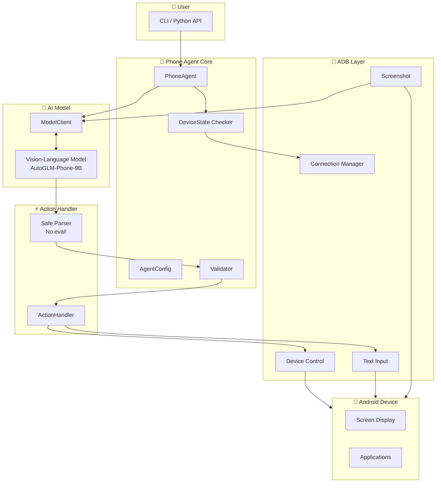
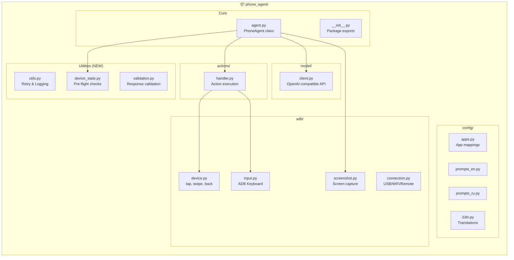
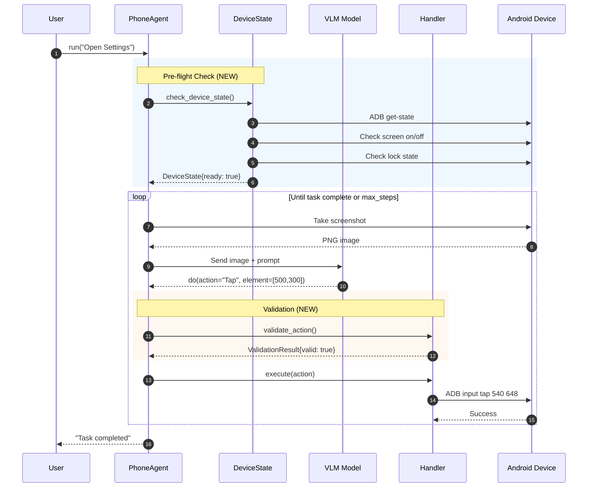

# Open-AutoGLM (Secure Fork)

> 🔒 **Security-hardened fork** of [zai-org/Open-AutoGLM](https://github.com/zai-org/Open-AutoGLM) with Russian/English localization and enhanced reliability features.

[](LICENSE)
[](https://python.org)
[](#security-improvements)

---

## 📖 What is This?

**Phone Agent** is an AI-powered framework for automating Android devices using Vision-Language Models (VLM). It captures screenshots, understands UI elements, and executes actions like tapping, swiping, and typing — all controlled by natural language commands.

### Who is This For?

| Audience | Use Case |
|----------|----------|
| **QA Engineers** | Automated UI testing without writing scripts |
| **Accessibility** | Voice-controlled phone automation for users with disabilities |
| **Researchers** | Studying AI agents and mobile automation |
| **Developers** | Prototyping AI-driven mobile applications |

### Example

```bash
python main.py --lang en "Open Chrome and search for weather forecast"
```

The agent will:
1. Take a screenshot
2. Identify Chrome icon
3. Tap to open
4. Find search bar
5. Type the query
6. Report completion

---

## 🏗️ Architecture

### High-Level Overview



### Detailed Component Diagram



### Execution Flow



---

## ⚠️ Why This Fork?

### Original Project Issues

The [original Open-AutoGLM](https://github.com/zai-org/Open-AutoGLM) has **critical security vulnerabilities** that make it unsafe for production use:

#### 🔴 Critical: Remote Code Execution (RCE)

**File**: `phone_agent/actions/handler.py` (line 285)

```python
# DANGEROUS - Original code
if response.startswith("do"):
    action = eval(response)  # ← Executes arbitrary Python code!
```

**Risk**: If an attacker compromises the model server or performs a MITM attack, they can inject malicious code:

```python
# Attacker sends this instead of normal action:
do(action="Tap") or __import__('os').system('rm -rf /')
```

This would execute system commands on your machine.

#### 🟡 Other Issues

| Issue | Description |
|-------|-------------|
| **Chinese-only** | Original prompts and UI are primarily in Chinese |
| **No device checks** | Agent starts without verifying device is ready |
| **No retry logic** | ADB commands fail silently on first error |
| **No logging** | Hard to debug issues |
| **No validation** | Invalid coordinates crash the agent |

---

## 🔒 Security Improvements

### What We Fixed

| Vulnerability | Solution |
|---------------|----------|
| `eval()` RCE | Replaced with regex-based safe parser |
| No input validation | Added coordinate range checking (0-999) |
| No action whitelist | Only known actions are executed |

### Safe Parser Implementation

```python
# NEW - Safe parsing without eval()
def _safe_parse_do_action(response: str) -> dict:
    """Parse do(...) using regex, not eval()."""
    import re
    import json
    
    result = {"_metadata": "do"}
    pattern = r'(\w+)\s*=\s*(?:"([^"]*)"|\[([^\]]*)\])'
    
    for match in re.finditer(pattern, response):
        key, str_val, arr_val = match.groups()
        if str_val is not None:
            result[key] = str_val
        elif arr_val is not None:
            result[key] = json.loads(f"[{arr_val}]")
    
    return result
```

---

## 📲 Installation

### Prerequisites

| Component | Version | Notes |
|-----------|---------|-------|
| Python | 3.10+ | Required |
| ADB | Latest | Android SDK Platform Tools |
| Android Device | 7.0+ | USB debugging enabled |
| ADB Keyboard | - | Required for text input |

### Step 1: Install ADB

<details>
<summary><b>Windows</b></summary>

1. Download [Platform Tools](https://developer.android.com/tools/releases/platform-tools)
2. Extract to `C:\platform-tools`
3. Add to PATH:
   ```powershell
   [Environment]::SetEnvironmentVariable("Path", $env:Path + ";C:\platform-tools", "User")
   ```
4. Restart terminal

</details>

<details>
<summary><b>macOS</b></summary>

```bash
brew install android-platform-tools
```

</details>

<details>
<summary><b>Linux</b></summary>

```bash
sudo apt install android-tools-adb
```

</details>

### Step 2: Enable USB Debugging on Android

1. Go to **Settings** → **About Phone**
2. Tap **Build Number** 7 times (enables Developer Options)
3. Go to **Settings** → **Developer Options**
4. Enable **USB Debugging**
5. Connect phone via USB
6. Accept the RST key prompt on phone

### Step 3: Install ADB Keyboard

Download and install [ADB Keyboard APK](https://github.com/senzhk/ADBKeyBoard/raw/master/ADBKeyboard.apk):

```bash
adb install ADBKeyboard.apk
```

Enable it: **Settings** → **Languages & Input** → **Virtual Keyboard** → **ADB Keyboard**

### Step 4: Install Phone Agent

```bash
git clone https://github.com/YOUR_USERNAME/Open-AutoGLM.git
cd Open-AutoGLM
pip install -e .
```

### Step 5: Set Up Model

Option A: **Cloud API** (recommended for testing)
```bash
# BigModel API
export PHONE_AGENT_BASE_URL="https://open.bigmodel.cn/api/paas/v4"
export PHONE_AGENT_API_KEY="your-api-key"
export PHONE_AGENT_MODEL="autoglm-phone"
```

Option B: **Local Model** (requires GPU)
```bash
# Deploy with vLLM or sglang
python -m vllm.entrypoints.openai.api_server \
    --model zai-org/AutoGLM-Phone-9B \
    --port 8000
```

### Step 6: Verify Installation

```bash
python main.py --list-devices
# Should show your connected device

python main.py --lang en "Open Settings"
# Should navigate to Settings app
```

---

## 🚀 Usage

### Command Line

```bash
# Interactive mode
python main.py --lang en

# Single task
python main.py --lang en "Open Chrome and search for Python tutorials"

# Russian interface
python main.py --lang ru "Открой настройки и проверь WiFi"

# Remote device
python main.py --connect 192.168.1.100:5555 --lang en "Open Gmail"
```

### Python API

```python
from phone_agent import PhoneAgent, setup_logging, check_device_state
from phone_agent.agent import AgentConfig
from phone_agent.model import ModelConfig
import logging

# Enable logging
setup_logging(logging.INFO, log_file="agent.log")

# Check device before starting
state = check_device_state()
if not state.is_ready:
    print(f"Device issues: {state.get_issues()}")
    exit(1)

# Configure
model_config = ModelConfig(
    base_url="http://localhost:8000/v1",
    model_name="autoglm-phone-9b",
)

agent_config = AgentConfig(
    max_steps=50,
    lang="en",  # or "ru"
    check_device_state=True,  # Pre-flight checks enabled
)

# Run
agent = PhoneAgent(model_config, agent_config)
result = agent.run("Open Telegram and check messages")
print(f"Result: {result}")
```

---

## 📁 Project Structure

```
Open-AutoGLM/
├── main.py                    # CLI entry point
├── Dockerfile                 # 🆕 Docker container
├── docker-compose.yml         # 🆕 Docker Compose
├── phone_agent/
│   ├── __init__.py           # Package exports
│   ├── agent.py              # PhoneAgent class
│   ├── utils.py              # 🆕 Retry, logging
│   ├── device_state.py       # 🆕 Device checks
│   ├── validation.py         # 🆕 Response validation
│   ├── models.py             # 🆕 Pydantic models
│   ├── ui_tree.py            # 🆕 UI element detection
│   ├── api.py                # 🆕 REST API (FastAPI)
│   ├── web_ui.py             # 🆕 Web Dashboard
│   ├── adb/
│   │   ├── connection.py     # USB/WiFi/Remote
│   │   ├── device.py         # Tap, swipe, etc.
│   │   ├── screenshot.py     # Screen capture
│   │   └── input.py          # ADB Keyboard
│   ├── actions/
│   │   └── handler.py        # 🔧 Safe parser (fixed)
│   ├── model/
│   │   └── client.py         # OpenAI API client
│   └── config/
│       ├── apps.py           # App mappings
│       ├── prompts_en.py     # English prompts
│       ├── prompts_ru.py     # 🆕 Russian prompts
│       └── i18n.py           # Translations
├── tests/                     # 🆕 Unit tests
│   └── test_phone_agent.py
├── .github/workflows/         # 🆕 CI/CD
│   └── ci.yml
└── README.md
```

---

## 🌐 Web UI & REST API

### Web Dashboard

Launch the web interface to monitor and control the agent:

```bash
python -m phone_agent.web_ui
# Open http://localhost:3000/ui
```

Features:
- 📱 Live device status (battery, screen, app)
- 🎯 Execute tasks via natural language
- 📋 Click on UI elements directly
- 📝 Action log with timestamps

### REST API

Run the API server for programmatic access:

```bash
python -m phone_agent.api --host 127.0.0.1 --port 8080 --api-key your-secret-key
```

**Endpoints:**

| Method | Endpoint | Description |
|--------|----------|-------------|
| GET | `/` | API status |
| GET | `/device` | Device state |
| GET | `/ui/tree` | UI elements |
| POST | `/task` | Execute task |
| POST | `/action` | Execute single action |

**Security features:**
- 🔒 Localhost-only by default
- 🔑 API key authentication
- ⏱️ Rate limiting (60 req/min)
- 📋 Action whitelist

---

## 🐳 Docker

### Quick Start

```bash
# Build image
docker build -t phone-agent .

# Run with USB passthrough (Linux)
docker run -v /dev/bus/usb:/dev/bus/usb phone-agent

# Or use Docker Compose
docker-compose up
```

### Environment Variables

| Variable | Default | Description |
|----------|---------|-------------|
| `PHONE_AGENT_LANG` | `en` | Language (en/ru) |
| `PHONE_AGENT_BASE_URL` | `http://localhost:8000/v1` | Model API URL |
| `PHONE_AGENT_API_KEY` | - | Model API key |

---

## 🎯 UI Tree Parsing

Access UI elements programmatically for precise interactions:

```python
from phone_agent import get_ui_tree, find_element_coordinates

# Get all UI elements
tree = get_ui_tree()

# Find element by text
button = tree.find_one(text="Submit", clickable=True)
if button:
    print(f"Found at {button.center}")  # (540, 800)

# Find all input fields
inputs = tree.get_input_fields()

# Find coordinates by text
coords = find_element_coordinates(text="Login")
```

---

## 🧪 Testing

Run the test suite:

```bash
# Install dev dependencies
pip install pytest pytest-cov

# Run tests
pytest tests/ -v

# With coverage
pytest tests/ --cov=phone_agent --cov-report=html
```

---

## 📦 Pydantic Models

Type-safe configuration with validation:

```python
from phone_agent import (
    ModelConfigPydantic,
    AgentConfigPydantic,
    ActionRequest,
    ActionType,
    Coordinates,
)

# Validated config (raises on invalid values)
model_config = ModelConfigPydantic(
    base_url="http://localhost:8000/v1",
    temperature=0.1,  # Must be 0.0-2.0
)

# Validated action
action = ActionRequest(
    action=ActionType.TAP,
    element=Coordinates(x=500, y=300),  # Must be 0-999
)
```


---

## 🔗 Links

- **Original Project**: [zai-org/Open-AutoGLM](https://github.com/zai-org/Open-AutoGLM)
- **Model (HuggingFace)**: [AutoGLM-Phone-9B](https://huggingface.co/zai-org/AutoGLM-Phone-9B)
- **Model (ModelScope)**: [AutoGLM-Phone-9B](https://modelscope.cn/models/ZhipuAI/AutoGLM-Phone-9B)
- **ADB Keyboard**: [senzhk/ADBKeyBoard](https://github.com/senzhk/ADBKeyBoard)

---

## 📄 License

Apache License 2.0 — see [LICENSE](LICENSE).

---

## ⚠️ Disclaimer

This project is for **research and educational purposes only**. Do not use for:
- Unauthorized access to devices
- Bypassing security measures
- Any illegal activities

Always obtain proper authorization before automating any device.
