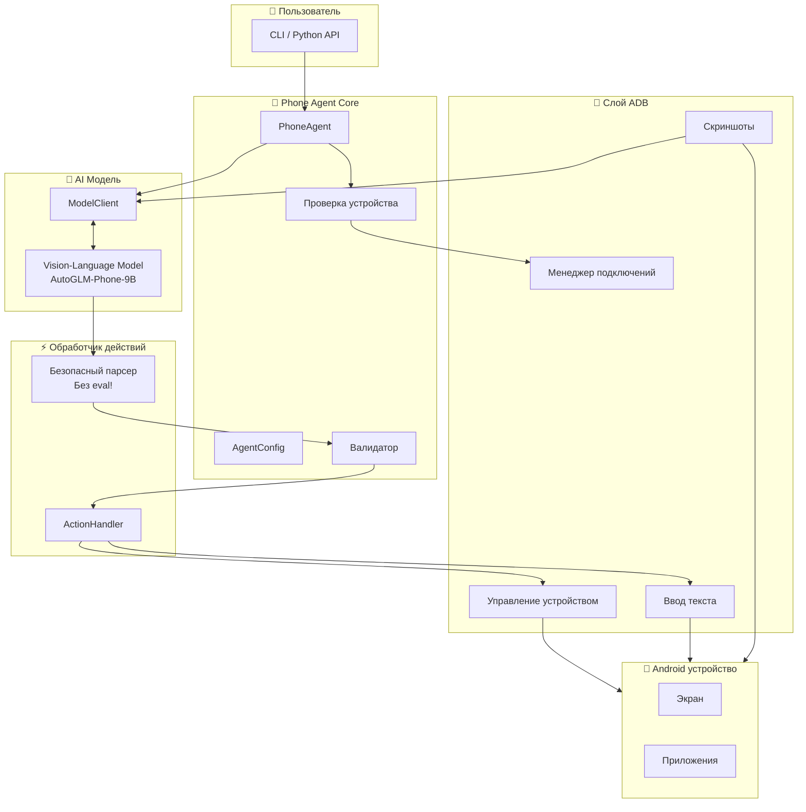

# Open-AutoGLM (Безопасный форк)

> 🔒 **Форк с улучшенной безопасностью** проекта [zai-org/Open-AutoGLM](https://github.com/zai-org/Open-AutoGLM) с локализацией на русский/английский и дополнительными функциями надёжности.

[](LICENSE)
[](https://python.org)
[](#исправления-безопасности)

---

## 📖 Что это?

**Phone Agent** — это AI-фреймворк для автоматизации Android-устройств с помощью мультимодальных моделей (VLM). Он делает скриншоты, понимает элементы интерфейса и выполняет действия: касания, свайпы, ввод текста — всё управляется командами на естественном языке.

### Для кого этот продукт?

| Аудитория | Применение |
|-----------|------------|
| **QA-инженеры** | Автоматизированное тестирование UI без написания скриптов |
| **Доступность** | Голосовое управление телефоном для людей с ограниченными возможностями |
| **Исследователи** | Изучение AI-агентов и мобильной автоматизации |
| **Разработчики** | Прототипирование AI-приложений для мобильных устройств |

### Пример

```bash
python main.py --lang ru "Открой Chrome и найди прогноз погоды"
```

Агент выполнит:
1. Сделает скриншот
2. Найдёт иконку Chrome
3. Нажмёт для открытия
4. Найдёт строку поиска
5. Введёт запрос
6. Сообщит о завершении

---

## 🏗️ Архитектура

### Общая схема



### Диаграмма компонентов

```mermaid
flowchart LR
    subgraph phone_agent["📦 phone_agent/"]
        direction TB
        
        subgraph core["Ядро"]
            agent[agent.py<br/>Класс PhoneAgent]
            init[__init__.py<br/>Экспорты пакета]
        end
        
        subgraph adb["adb/"]
            connection[connection.py<br/>USB/WiFi/Remote]
            device[device.py<br/>tap, swipe, back]
            screenshot[screenshot.py<br/>Захват экрана]
            input[input.py<br/>ADB Keyboard]
        end
        
        subgraph actions["actions/"]
            handler[handler.py<br/>Выполнение действий]
        end
        
        subgraph model["model/"]
            client[client.py<br/>OpenAI-совместимый API]
        end
        
        subgraph config["config/"]
            apps[apps.py<br/>Маппинг приложений]
            prompts_en[prompts_en.py]
            prompts_ru[prompts_ru.py]
            i18n[i18n.py<br/>Переводы]
        end
        
        subgraph utils["Утилиты (НОВОЕ)"]
            utils_py[utils.py<br/>Retry и логирование]
            device_state[device_state.py<br/>Проверки устройства]
            validation[validation.py<br/>Валидация ответов]
        end
    end
    
    agent --> handler
    agent --> client
    agent --> device_state
    handler --> device
    handler --> input
    agent --> screenshot
```



---

## ⚠️ Почему форк?

### Проблемы оригинального проекта

[Оригинальный Open-AutoGLM](https://github.com/zai-org/Open-AutoGLM) имеет **критические уязвимости безопасности**, делающие его небезопасным для использования:

#### 🔴 Критично: Удалённое выполнение кода (RCE)

**Файл**: `phone_agent/actions/handler.py` (строка 285)

```python
# ОПАСНО - Оригинальный код
if response.startswith("do"):
    action = eval(response)  # ← Выполняет произвольный Python код!
```

**Риск**: Если злоумышленник скомпрометирует сервер модели или проведёт MITM-атаку, он может внедрить вредоносный код:

```python
# Атакующий отправляет вместо нормального action:
do(action="Tap") or __import__('os').system('rm -rf /')
```

Это выполнит системные команды на вашей машине.

#### 🟡 Другие проблемы

| Проблема | Описание |
|----------|----------|
| **Только китайский** | Оригинальные промпты и UI на китайском |
| **Нет проверки устройства** | Агент стартует без проверки готовности устройства |
| **Нет retry-логики** | ADB команды падают при первой ошибке |
| **Нет логирования** | Сложно отлаживать проблемы |
| **Нет валидации** | Неверные координаты крашат агента |

---

## 🔒 Исправления безопасности

### Что мы исправили

| Уязвимость | Решение |
|------------|---------|
| `eval()` RCE | Заменён на regex-парсер |
| Нет валидации ввода | Добавлена проверка диапазона координат (0-999) |
| Нет whitelist действий | Выполняются только известные действия |

---

## 📲 Установка

### Требования

| Компонент | Версия | Примечание |
|-----------|--------|------------|
| Python | 3.10+ | Обязательно |
| ADB | Последняя | Android SDK Platform Tools |
| Android устройство | 7.0+ | USB отладка включена |
| ADB Keyboard | - | Требуется для ввода текста |

### Шаг 1: Установка ADB

**Windows**:
1. Скачайте [Platform Tools](https://developer.android.com/tools/releases/platform-tools)
2. Распакуйте в `C:\platform-tools`
3. Добавьте в PATH в переменных среды

**Linux**:
```bash
sudo apt install android-tools-adb
```

### Шаг 2: Включите USB-отладку на Android

1. **Настройки** → **О телефоне**
2. Нажмите **Номер сборки** 7 раз (включает режим разработчика)
3. **Настройки** → **Для разработчиков**
4. Включите **Отладка по USB**
5. Подключите телефон по USB
6. Подтвердите запрос на телефоне

### Шаг 3: Установите ADB Keyboard

```bash
adb install ADBKeyboard.apk
```

Скачать: [ADB Keyboard APK](https://github.com/senzhk/ADBKeyBoard/raw/master/ADBKeyboard.apk)

Включите: **Настройки** → **Язык и ввод** → **Виртуальная клавиатура** → **ADB Keyboard**

### Шаг 4: Установите Phone Agent

```bash
git clone https://github.com/YOUR_USERNAME/Open-AutoGLM.git
cd Open-AutoGLM
pip install -e .
```

### Шаг 5: Проверьте установку

```bash
python main.py --list-devices
# Должен показать подключённое устройство

python main.py --lang ru "Открой настройки"
# Должен открыть приложение Настройки
```

---

## 🚀 Использование

### Командная строка

```bash
# Интерактивный режим
python main.py --lang ru

# Одна задача
python main.py --lang ru "Открой Chrome и найди уроки Python"

# Удалённое устройство
python main.py --connect 192.168.1.100:5555 --lang ru "Открой Gmail"
```

### Python API

```python
from phone_agent import PhoneAgent, setup_logging, check_device_state
from phone_agent.agent import AgentConfig
from phone_agent.model import ModelConfig
import logging

# Включаем логирование
setup_logging(logging.INFO, log_file="agent.log")

# Проверяем устройство
state = check_device_state()
if not state.is_ready:
    print(f"Проблемы: {state.get_issues()}")
    exit(1)

# Настройка
model_config = ModelConfig(
    base_url="http://localhost:8000/v1",
    model_name="autoglm-phone-9b",
)

agent_config = AgentConfig(
    max_steps=50,
    lang="ru",
    check_device_state=True,
)

# Запуск
agent = PhoneAgent(model_config, agent_config)
result = agent.run("Открой Telegram и проверь сообщения")
print(f"Результат: {result}")
```

---

## 🌐 Web UI и REST API

### Web Dashboard

Запустите веб-интерфейс для мониторинга и управления агентом:

```bash
python -m phone_agent.web_ui
# Откройте http://localhost:3000/ui
```

Возможности:
- 📱 Статус устройства (батарея, экран, приложение)
- 🎯 Выполнение задач на естественном языке
- 📋 Клик по UI элементам напрямую
- 📝 Лог действий с временными метками

### REST API

Запустите API сервер для программного доступа:

```bash
python -m phone_agent.api --host 127.0.0.1 --port 8080 --api-key ваш-секретный-ключ
```

**Эндпоинты:**

| Метод | Путь | Описание |
|-------|------|----------|
| GET | `/` | Статус API |
| GET | `/device` | Состояние устройства |
| GET | `/ui/tree` | UI элементы |
| POST | `/task` | Выполнить задачу |
| POST | `/action` | Выполнить действие |

**Защита:**
- 🔒 Только localhost по умолчанию
- 🔑 Аутентификация по API ключу
- ⏱️ Rate limiting (60 запросов/мин)
- 📋 Whitelist действий

---

## 🐳 Docker

```bash
# Сборка образа
docker build -t phone-agent .

# Запуск с USB (Linux)
docker run -v /dev/bus/usb:/dev/bus/usb phone-agent

# Или через Docker Compose
docker-compose up
```

---

## 🎯 Парсинг UI Tree

Программный доступ к UI элементам:

```python
from phone_agent import get_ui_tree, find_element_coordinates

# Получить все элементы
tree = get_ui_tree()

# Найти элемент по тексту
button = tree.find_one(text="Отправить", clickable=True)
if button:
    print(f"Найдено: {button.center}")  # (540, 800)

# Найти координаты по тексту
coords = find_element_coordinates(text="Войти")
```

---

## 🧪 Тестирование

```bash
# Установка dev зависимостей
pip install pytest pytest-cov

# Запуск тестов
pytest tests/ -v

# С покрытием
pytest tests/ --cov=phone_agent --cov-report=html
```

---

## 🔗 Ссылки

- **Оригинальный проект**: [zai-org/Open-AutoGLM](https://github.com/zai-org/Open-AutoGLM)
- **Модель (HuggingFace)**: [AutoGLM-Phone-9B](https://huggingface.co/zai-org/AutoGLM-Phone-9B)
- **ADB Keyboard**: [senzhk/ADBKeyBoard](https://github.com/senzhk/ADBKeyBoard)

---

## 📄 Лицензия

Apache License 2.0 — см. файл [LICENSE](LICENSE).

---

## ⚠️ Отказ от ответственности

Проект предназначен **только для исследований и обучения**. Не используйте для:
- Несанкционированного доступа к устройствам
- Обхода мер безопасности
- Любой незаконной деятельности

Всегда получайте надлежащее разрешение перед автоматизацией любого устройства.
